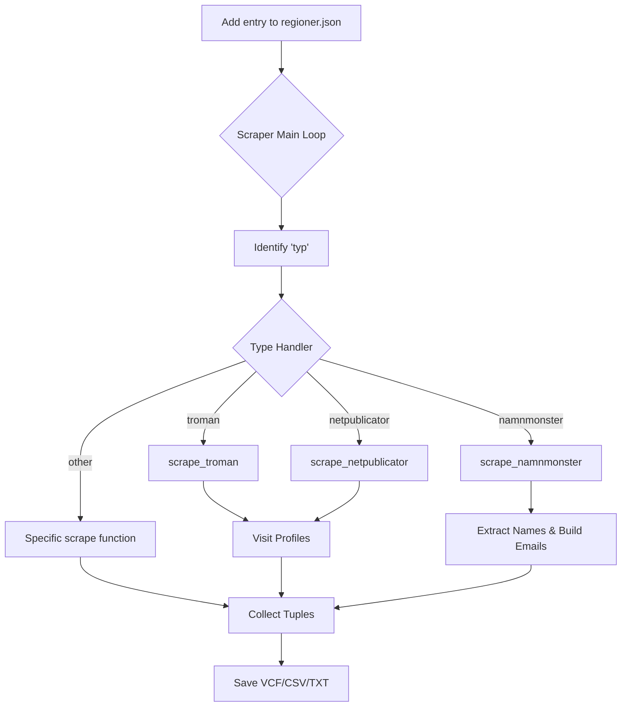

<details>
<summary>Relevant source files</summary>

The following files were used as context for generating this wiki page:

- [scraper/regioner.json](scraper/regioner.json)
- [scraper/scraper.py](scraper/scraper.py)
- [CLAUDE.md](CLAUDE.md)
- [AGENTS.md](AGENTS.md)
- [UNSUPPORTED_KOMMUNER.md](UNSUPPORTED_KOMMUNER.md)
- [README.md](README.md)
</details>

# Adding New Municipalities

Adding new municipalities (kommuner) or regions to the scraper involves configuring the data source and scraper type in the project's central configuration. The system is designed to handle various Swedish municipal platforms like Troman, Netpublicator, and W3D3, as well as custom scraping methods for unstructured pages.

Sources: [CLAUDE.md:65-70](CLAUDE.md#L65-L70), [AGENTS.md:37-41](AGENTS.md#L37-L41)

## Configuration Overview

The primary method for adding a municipality is to append a new entry to the `scraper/regioner.json` file. This JSON file acts as the single source of truth for both the main scraper (`scraper.py`) and the backfill scripts.

Sources: [scraper/scraper.py:46-48](scraper/scraper.py#L46-L48), [CLAUDE.md:65-70](CLAUDE.md#L65-L70)

### Entry Structure
Each entry in `regioner.json` requires a `namn` (the name of the municipality or region) and a `typ` (the scraper implementation to use). Additional fields vary depending on the selected type.

```json
{
  "namn": "Example Municipality",
  "typ": "troman",
  "url": "https://example.tromanpublik.se/organisation/..."
}
```

Sources: [scraper/regioner.json:1-10](scraper/regioner.json#L1-L10), [README.md:104-106](README.md#L104-L106)

## Scraper Types and Parameters

The system supports several specialized scraper types based on the software used by the municipality's representative register.

| Type | Description | Required Parameters |
| :--- | :--- | :--- |
| `troman` | For municipalities using Tromanpublik. | `url` |
| `netpublicator` | For Netpublicator-based registers. | `netpub_registry`, `netpub_board` |
| `w3d3` | For Formpipe W3D3 Representative Publishing. | `url` |
| `fmr` | For Livewire-based registers (e.g., Alingsås). | `url` |
| `profilsidor` | For sites with links to individual profiles. | `url`, `link_pattern`, `domain` |
| `namnmonster` | Builds emails based on name patterns (guessing). | `url`, `domain`, `section_start` |
| `namnlista` | Parses lists of names under party headings. | `url`, `domain`, `section_start` |
| `mailto` | Direct scraping of mailto links from a page. | `url` |
| `pdf` | Extracts contacts from downloadable PDF files. | `url`, `domain` |

Sources: [scraper/scraper.py:656-708](scraper/scraper.py#L656-L708), [CLAUDE.md:65-70](CLAUDE.md#L65-L70), [AGENTS.md:37-41](AGENTS.md#L37-L41)

## Adding a Municipality Flow

The following diagram illustrates the logical flow of how a municipality is processed by the scraper once added to the configuration.



The scraper iterates through the `REGIONER` list loaded from the JSON file and dispatches to the appropriate function based on the defined type.
Sources: [scraper/scraper.py:648-715](scraper/scraper.py#L648-L715), [AGENTS.md:29-35](AGENTS.md#L29-L35)

## Specialized Handlers Logic

### Netpublicator Logic
For municipalities using `netpublicator`, the entry must include specific UUIDs for the registry and the board. The scraper visits the board URL, extracts profile links, roles, and party affiliations directly from the listing table before visiting individual profile pages for email addresses.

Sources: [scraper/scraper.py:166-213](scraper/scraper.py#L166-L213)

### Name Pattern Guessing (namnmonster/namnlista)
If a municipality does not provide direct `mailto` links but specifies an email format (e.g., `firstname.lastname@municipality.se`), the `namnmonster` or `namnlista` types are used. These are flagged as `pattern-guess` in the final CSV output to distinguish them from verified scraped data.

Sources: [scraper/scraper.py:601-610](scraper/scraper.py#L601-L610), [scraper/scraper.py:417-458](scraper/scraper.py#L417-L458)

## Verification and Unsupported Entities

Before adding a new municipality, it must be verified that they publish full, named lists of representatives with actual email addresses. Some municipalities are explicitly unsupported because they:
*  Only publish emails for the presidium (chair/vice-chairs).
*  Require login (e.g., BankID via Ciceron).
*  Use searchable widgets with no static listing.

Sources: [UNSUPPORTED_KOMMUNER.md:12-40](UNSUPPORTED_KOMMUNER.md#L12-L40)

## Implementation Checklist

1.  **Identify the Source**: Find the official municipal page for "Kommunfullmäktige" or "Förtroendevalda".
2.  **Determine the Type**: Check the URL or page structure to identify if it's Troman, Netpublicator, W3D3, or a custom list.
3.  **Update `regioner.json`**: Add the JSON object with the required parameters.
4.  **Test Run**: Execute the scraper (locally or via Docker) and check the logs.

```bash
    docker compose up
    ```

5.  **Check Output**: Verify that a `.vcf` file was generated in the output directory and that the municipality appears in `Alla_kommuner_och_regioner.csv`.

Sources: [AGENTS.md:12-16](AGENTS.md#L12-L16), [README.md:104-106](README.md#L104-L106), [CLAUDE.md:65-70](CLAUDE.md#L65-L70)

## Summary
Adding a municipality is a configuration-driven process centered on `scraper/regioner.json`. By selecting the correct scraper type and providing the necessary URLs or identifiers, the system can automatically extract representative data, format it for mobile import (VCF), and prepare it for database synchronization via `sync_to_d1.py`.
