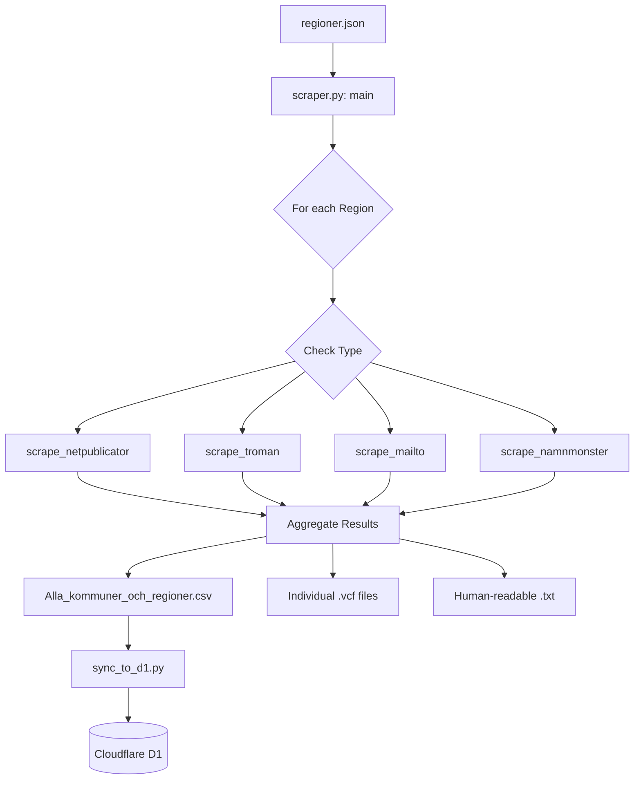
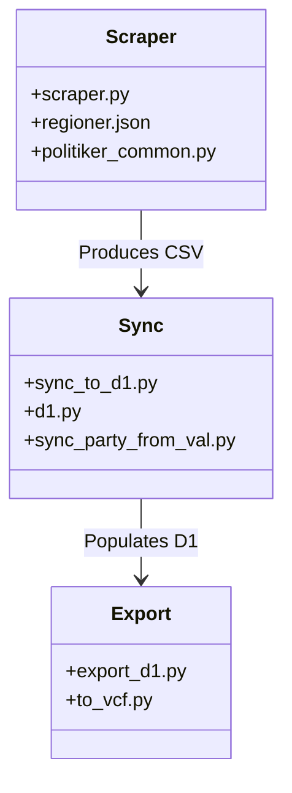

<details>
<summary>Relevant source files</summary>

The following files were used as context for generating this wiki page:

- [AGENTS.md](AGENTS.md)
- [CLAUDE.md](CLAUDE.md)
- [scraper/scraper.py](scraper/scraper.py)
- [README.md](README.md)
- [SECURITY.md](SECURITY.md)
</details>

# AI Agent Development Guidelines

## Introduction
The AI Agent Development Guidelines provide a structured framework for contributors and automated agents to maintain, extend, and operate the `politiker-kontakter` scraper system. The project's primary goal is to collect publicly available email addresses of elected officials in Sweden's 290 municipalities and 21 regions, as well as representatives in the Riksdag, EU Parliament, and government departments.

These guidelines ensure that agents adhere to the project's technical stack—primarily Python, Playwright, and Docker—while respecting strict data privacy and security constraints. Agents must follow specific conventions regarding TLS validation, credential handling, and the Swedish alphabetical sorting order (`swedish_key`) to ensure data integrity across the platform.
Sources: [AGENTS.md:1-10](AGENTS.md#L1-L10), [README.md:1-5](README.md#L1-L5)

## Core Development Principles

### Permitted and Forbidden Actions
Agents operating within this repository are bound by specific operational constraints to ensure the stability of the `main` branch and the security of the infrastructure.

| Action Category | Description |
| :--- | :--- |
| **Allowed** | Create branches, modify code, run tests, open Pull Requests (PRs). |
| **Forbidden** | Push directly to main/master, merge PRs, delete branches, disable workflows, modify secrets, change GitHub org settings. |
| **Requirements** | All tests must pass, PRs must be focused, no unrelated changes, never commit credentials, never force push. |

Sources: [AGENTS.md:36-53](AGENTS.md#L36-L53)

### Security and Technical Conventions
Development must prioritize the security of the scraping process and the privacy of the data sources.

*  **No Credentials:** The system only handles data that is already publicly published. No login credentials or secrets should be implemented for scrapers.
*  **TLS Validation:** Agents must never disable TLS validation (e.g., using `ignore_https_errors`) in committed code. These workarounds are strictly for local testing.
*  **Checkpointing:** For long-running scrapes (273+ entities), agents should implement checkpointing for names and emails per region rather than writing a single final file.
*  **Dependencies:** Security updates for libraries like Playwright and `pypdf` are managed via Renovate/Dependabot.

Sources: [AGENTS.md:28-34](AGENTS.md#L28-L34), [CLAUDE.md:65-71](CLAUDE.md#L65-L71), [SECURITY.md:1-17](SECURITY.md#L1-L17)

## Architecture and Data Flow

The project follows a modular scraping architecture where specialized functions handle different CMS types used by Swedish authorities.

### Scraper Execution Flow
The following diagram illustrates how the `scraper.py` main logic interacts with regional configurations to produce various output formats.



The scraper iterates through `regioner.json`, matches the "typ" field to a specific scraping function, and aggregates the results into machine-readable and human-readable formats.
Sources: [scraper/scraper.py:657-735](scraper/scraper.py#L657-L735), [CLAUDE.md:33-47](CLAUDE.md#L33-L47)

### Data Models
Each scraping function (`scrape_*`) is required to return a `set()` of tuples containing politician data.

| Field | Description | Note |
| :--- | :--- | :--- |
| **Name** | Full name of the politician | May be an empty string if extraction fails |
| **Email** | Publicly published email address | Verified against `EMAIL_RE` |
| **Party** | Political party affiliation | Normalized via `politiker_common.py` |
| **Role** | Official title/role | e.g., "Ledamot", "Ordförande" |

Sources: [AGENTS.md:21-26](AGENTS.md#L21-L26), [CLAUDE.md:33-36](CLAUDE.md#L33-L36), [scraper/scraper.py:77-78](scraper/scraper.py#L77-L78)

## Implementation Guidelines

### Adding New Municipalities/Regions
To add support for a new entity, agents should modify `scraper/regioner.json`. The entry must include the URL and a "typ" corresponding to the target's CMS or listing style.

Common supported types include:
*  `netpublicator`: For Netpublicator registries.
*  `troman`: For Troman Publik systems.
*  `w3d3`: For Formpipe W3D3 systems.
*  `namnmonster` / `namnlista`: For sites where emails follow a predictable pattern (e.g., `firstname.lastname@municipality.se`).
*  `mailto`: For simple direct extraction of mailto links.

Sources: [AGENTS.md:28-31](AGENTS.md#L28-L31), [CLAUDE.md:58-63](CLAUDE.md#L58-L63), [scraper/scraper.py:670-717](scraper/scraper.py#L670-L717)

### Handling Swedish Localization
Agents must use the `swedish_key` function for all sorting operations to ensure that characters like Å, Ä, and Ö are sorted correctly after Z, independent of the operating system's locale settings.

```python
def swedish_key(name: str):
    """Sorting key for Swedish alphabetical order."""
    s = name.lower()
    return s.replace("å", "{").replace("ä", "|").replace("ö", "}")
```

Sources: [scraper/scraper.py:115-119](scraper/scraper.py#L115-L119), [AGENTS.md:25-26](AGENTS.md#L25-L26)

### Project Structure for Agents
Agents should prioritize modifications within the `scraper/` directory for logic changes and `data/` for stable exports.



The relationship between core modules ensures that scraping logic is decoupled from database synchronization and final data export.
Sources: [CLAUDE.md:14-30](CLAUDE.md#L14-L30), [README.md:68-85](README.md#L68-L85)

## Conclusion
The AI Agent Development Guidelines ensure that the `politiker-kontakter` project remains a reliable and secure source of contact information for Swedish elected officials. By following these standardized scraping patterns, security protocols, and data models, agents can effectively contribute to the maintenance of the ~17,000 records within the database while ensuring technical consistency across the codebase.
Sources: [README.md:12-16](README.md#L12-L16), [AGENTS.md:1-5](AGENTS.md#L1-L5)
