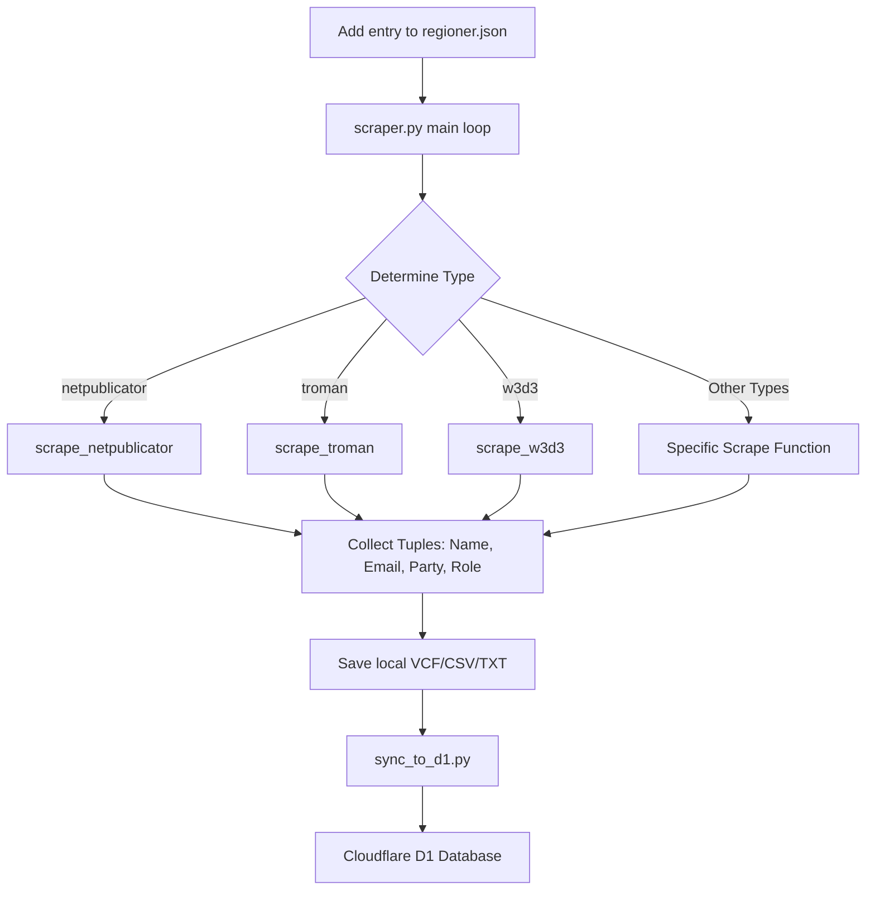

<details>
<summary>Relevant source files</summary>

The following files were used as context for generating this wiki page:

- [scraper/scraper.py](scraper/scraper.py)
- [scraper/regioner.json](scraper/regioner.json)
- [CLAUDE.md](CLAUDE.md)
- [AGENTS.md](AGENTS.md)
- [README.md](README.md)
- [scraper/backfill_kommun_role_party.py](scraper/backfill_kommun_role_party.py)
</details>

# Adding New Regions

Adding a new region or municipality to the **politiker-kontakter** project involves configuring a new entry in the centralized data repository to enable automated scraping of elected officials' contact information. The system is designed to support various web platforms used by Swedish local governments, ranging from specialized registry systems to static PDF lists.

The process primarily requires identifying the correct "type" of the municipality's public representative list and adding its metadata to `scraper/regioner.json`. Once added, the main scraper engine uses this configuration to navigate, extract, and format contact data into VCF, TXT, and CSV formats.
Sources: [README.md:95-97](README.md#L95-L97), [CLAUDE.md:73-77](CLAUDE.md#L73-L77), [AGENTS.md:5-9](AGENTS.md#L5-L9)

## Configuration Overview

The core of the region management system is the `scraper/regioner.json` file. This file acts as a registry that both the Playwright-based scraper (`scraper.py`) and the backfill utility (`backfill_kommun_role_party.py`) use to locate and process data.
Sources: [README.md:65-67](README.md#L65-L67), [CLAUDE.md:75-77](CLAUDE.md#L75-L77)

### Data Flow for New Regions

When a region is added to the configuration, it follows a specific processing pipeline:



The diagram above shows how the `typ` field in the JSON configuration directs the scraper to the appropriate logic.
Sources: [scraper/scraper.py:657-731](scraper/scraper.py#L657-L731), [CLAUDE.md:43-52](CLAUDE.md#L43-L52)

## Supported Scraper Types

Choosing the correct `typ` is critical. Each type requires specific additional fields in the JSON configuration.

| Type | Description | Required Fields |
| :--- | :--- | :--- |
| `netpublicator` | Used for Netpublicator-based registers. | `namn`, `typ`, `netpub_registry`, `netpub_board` |
| `troman` | Used for Troman (tromanpublik.se) registers. | `namn`, `typ`, `url` |
| `w3d3` | Used for Formpipe W3D3 representative publishing. | `namn`, `typ`, `url` |
| `fmr` | Used for Livewire-based registers (e.g., Alingsås). | `namn`, `typ`, `url` |
| `profilsidor` | Used for bespoke profile pages under a specific link pattern. | `namn`, `typ`, `url`, `link_pattern`, `domain` |
| `namnmonster` | Guesses emails based on a name pattern (e.g., firstname.lastname@domain). | `namn`, `typ`, `url`, `domain`, `section_start` |
| `namnlista` | Similar to pattern-guess but handles list-style names. | `namn`, `typ`, `url`, `domain`, `section_start` |
| `mailto` | Fallback that scrapes all `mailto:` links on a page. | `namn`, `typ`, `url` |
| `pdf` | Extracts email/name pairs from a downloadable PDF file. | `namn`, `typ`, `url`, `domain` |

Sources: [scraper/scraper.py:680-728](scraper/scraper.py#L680-L728), [CLAUDE.md:73-77](CLAUDE.md#L73-L77)

## Implementation Details

### Registry Systems (Troman & Netpublicator)
For systems like `troman` and `netpublicator`, the scraper performs two steps:
1.  **List Extraction**: It fetches the main board or committee list to find individual representative URLs.
2.  **Profile Scraping**: It visits each profile URL to extract the specific `mailto` link, person's name, party, and role.
Sources: [scraper/scraper.py:171-260](scraper/scraper.py#L171-L260), [scraper/backfill_kommun_role_party.py:73-157](scraper/backfill_kommun_role_party.py#L73-L157)

### Pattern-Based Guesstimation
Types like `namnmonster` and `namnlista` do not find actual email links. Instead, they parse names from a specific text section (defined by `section_start` and `section_end`) and construct an email address using the `domain` field and a transliteration function.
Sources: [scraper/scraper.py:440-474](scraper/scraper.py#L440-L474), [scraper/scraper.py:504-548](scraper/scraper.py#L504-L548)

```python
# Transliterator used for pattern-based guesstimation
def _email_local_part(namn_del):
    s = namn_del.strip().lower()
    s = (s.replace("å", "a").replace("ä", "a").replace("ö", "o")
           .replace("é", "e").replace("ü", "u").replace("ø", "o"))
    s = re.sub(r"[´’'`]", "", s)
    s = re.sub(r"[^a-z0-9\-]", "", s)
    return s
```

Sources: [scraper/scraper.py:421-428](scraper/scraper.py#L421-L428)

## Validation and Syncing

After adding a region and running the scraper, several files are generated in the `OUTPUT_DIR`:
*  **VCF Files**: One `.vcf` file per region (e.g., `Lysekils_kommun.vcf`).
*  **CSV File**: `Alla_kommuner_och_regioner.csv`, which is used for database synchronization.
*  **Guesstimate Log**: `gissade_adresser.txt` lists all addresses generated via patterns for manual review.

The system distinguishes between "scraped" and "pattern-guess" sources. The `source` column in the CSV is used to flag addresses that were not verified via a direct `mailto` link.
Sources: [scraper/scraper.py:612-628](scraper/scraper.py#L612-L628), [scraper/scraper.py:633-652](scraper/scraper.py#L633-L652), [README.md:43-53](README.md#L43-L53)

## Step-by-Step Procedure

1.  **Identify the Target**: Locate the municipality's "förtroendemannaregister" (representative registry).
2.  **Determine Type**: Check the URL and page structure to match it against supported types (e.g., look for `netpublicator.com` or `tromanpublik.se`).
3.  **Update JSON**: Add the new object to `scraper/regioner.json`.
4.  **Test Locally**: Run `docker compose up` to execute the scraper and verify that a VCF file is created for the new entry.
5.  **Backfill (Optional)**: If the source is Netpublicator or Troman, run `scraper/backfill_kommun_role_party.py` to populate roles and parties without a full browser-based scrape.
Sources: [AGENTS.md:52-57](AGENTS.md#L52-L57), [README.md:95-97](README.md#L95-L97), [scraper/backfill_kommun_role_party.py:16-24](scraper/backfill_kommun_role_party.py#L16-L24)
