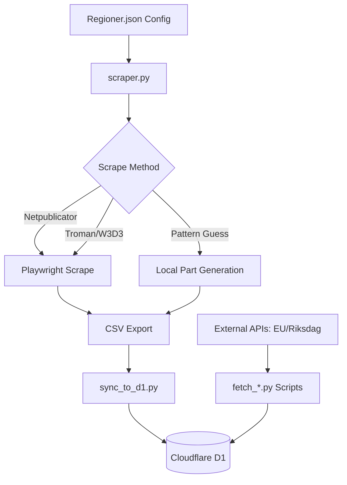
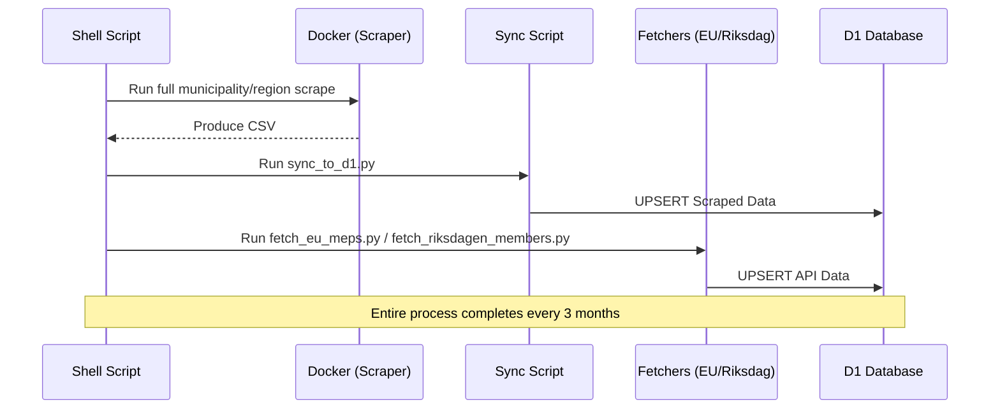

<details>
<summary>Relevant source files</summary>

The following files were used as context for generating this wiki page:

- [AGENTS.md](AGENTS.md)
- [CLAUDE.md](CLAUDE.md)
- [README.md](README.md)
- [scraper/scraper.py](scraper/scraper.py)
- [scraper/sync_to_d1.py](scraper/sync_to_d1.py)
- [scraper/quarterly_refresh.sh](scraper/quarterly_refresh.sh)
</details>

# AI Agent Development Guidelines

## Introduction
These guidelines provide a comprehensive framework for AI agents and developers working on the `politiker-kontakter` project. The project is a specialized scraper designed to extract public email addresses of elected officials in Sweden's 290 municipalities and 21 regions, as well as representatives in the EU Parliament, Riksdag, and Government departments.

The primary purpose of the system is to maintain a high-quality contact database that powers the [politiker-webapp](https://politiker.denied.se). The development environment is containerized using Docker and utilizes Python with Playwright for web scraping, while persisting data to a Cloudflare D1 database.
Sources: [AGENTS.md:1-6](AGENTS.md#L1-L6), [README.md:1-5](README.md#L1-L5)

## System Architecture and Tech Stack
The project follows a modular architecture where the core scraping logic is decoupled from data synchronization and verification tasks. 

### Core Components
*  **Scraper Engine**: Built with Python 3 and Playwright (headless Chromium) to navigate complex JavaScript-rendered sites.
*  **Data Processors**: Specialized scripts for PDF extraction (`pypdf`) and pattern-based email generation.
*  **Database**: Cloudflare D1 (SQLite-based) managed via a shared `D1Client`.
*  **Deployment**: Docker and Docker Compose for environment consistency.

Sources: [AGENTS.md:8-13](AGENTS.md#L8-L13), [CLAUDE.md:8-14](CLAUDE.md#L8-L14)

### Data Flow Diagram
The following diagram illustrates the lifecycle of data from initial scraping to final database persistence.



Sources: [scraper/scraper.py:651-689](scraper/scraper.py#L651-L689), [scraper/sync_to_d1.py:100-115](scraper/sync_to_d1.py#L100-L115)

## Development Workflow and Constraints

### Operational Commands
Developers and agents must use the following commands to initialize and run the environment:

| Task | Command |
| :--- | :--- |
| Setup Environment | `cp .env.example .env` |
| Start Scraper | `docker compose up` |
| Manual D1 Import | `wrangler d1 execute <db> --remote --file data/politiker.sql` |

Sources: [AGENTS.md:15-20](AGENTS.md#L15-L20), [README.md:32-34](README.md#L32-L34)

### Branching and Permissions
To maintain project integrity, strict rules apply to all automated agents and contributors:

*  **Allowed**: Creating branches, modifying code, running tests, and opening Pull Requests (PRs).
*  **Forbidden**: Pushing directly to `main`/`master`, merging PRs, deleting branches, disabling workflows, or modifying secrets.
*  **PR Requirements**: PRs must be focused, contain no unrelated changes, pass all tests, and never include credentials.

Sources: [AGENTS.md:52-70](AGENTS.md#L52-L70)

## Scraper Implementation Logic

### Handling Different Site Types
The project uses a registry-based approach defined in `scraper/regioner.json`. The `scraper.py` script implements specific logic for various CMS platforms used by Swedish authorities.

| Type | Logic Description |
| :--- | :--- |
| `netpublicator` | Extracts politician IDs and crawls profile pages for mailto links. |
| `troman` | Navigates Troman-based public registers. |
| `w3d3` | Handles Formpipe W3D3 member publications. |
| `namnmonster` | Generates emails based on `fornamn.efternamn@domain` patterns. |
| `pdf` | Uses `pypdf` to extract emails from downloadable member lists. |

Sources: [scraper/scraper.py:656-685](scraper/scraper.py#L656-L685), [CLAUDE.md:65-70](CLAUDE.md#L65-L70)

### Security and TLS Policy
A critical constraint for development is that TLS validation must **never** be disabled in committed code. The use of `ignore_https_errors` or similar workarounds is strictly forbidden in the main repository, as these belong only in local test environments.
Sources: [AGENTS.md:46-48](AGENTS.md#L46-L48), [CLAUDE.md:76-78](CLAUDE.md#L76-L78)

## Data Persistence and Synchronization

### D1 Database Schema Integration
Synchronization is handled by `scraper/sync_to_d1.py`, which reads from the `Alla_kommuner_och_regioner.csv` file produced by the scraper. It utilizes an `UPSERT` strategy to ensure existing records are updated without duplicates.

```sql
INSERT INTO politicians (id, name, email, area_name, area_type, party, role, last_scraped_at)
VALUES (lower(hex(randomblob(11))), ?, ?, ?, ?, ?, ?, ?)
ON CONFLICT(email, area_name) DO UPDATE SET 
    name = excluded.name, 
    party = excluded.party, 
    role = excluded.role, 
    last_scraped_at = excluded.last_scraped_at
```

Sources: [scraper/sync_to_d1.py:34-40](scraper/sync_to_d1.py#L34-L40)

### Quarterly Maintenance
The system includes a maintenance script, `scraper/quarterly_refresh.sh`, which orchestrates the full update cycle.



Sources: [scraper/quarterly_refresh.sh:10-38](scraper/quarterly_refresh.sh#L10-L38)

## Conclusion
Development of AI agents within this project requires a deep understanding of the diverse scraping strategies employed to handle fragmented public data sources. By adhering to the containerized workflow, strict PR guidelines, and standardized D1 synchronization patterns, contributors ensure the reliability of the Swedish politician contact database. Significant emphasis is placed on maintaining data accuracy through proper "source" flagging (scraped vs. pattern-guessed) and avoiding insecure TLS configurations.
Sources: [CLAUDE.md:40-45](CLAUDE.md#L40-L45), [AGENTS.md:46-50](AGENTS.md#L46-L50)
